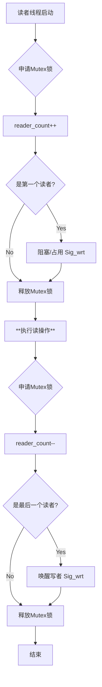

| 课程名称     | 操作系统                               | 实验名称     | 进程管理（读者-写者问题） |  
| -------- | ---------------------------------- | -------- | ------------- |  
| **学生姓名** | 王天翼                                | **学号**   | 2023210047    |  
| **实验日期** | 2025年11月18日                        | **专业**   | 计算机科学与技术      |  
| **实验环境** | macOS + OrbStack (openEuler 22.03) | **实验成绩** |               |  

## 一、 实验目的  

本实验旨在让学生通过动手设计和实现一个典型的进程同步互斥模型，深入理解操作系统中进程/线程协作的核心机制。具体目标包括：  

1. **理解并发原理**：通过模拟“读者-写者”这一经典 IPC（进程间通信）问题，深刻理解多线程环境下的资源竞争、死锁与饥饿现象。  
    
2. **掌握同步原语**：熟练掌握 Linux (openEuler) 环境下的 POSIX 线程库 (`pthread`)，特别是互斥量 (`pthread_mutex_t`) 和信号量 (`sem_t`) 的使用方法。  
    
3. **分析调度策略**：通过代码实现“读者优先”和“写者优先”两种不同的调度策略，对比分析它们对系统吞吐量和响应时间的不同影响。  
    
4. **提升工程能力**：掌握在 Linux 环境下使用 GCC 编译多线程程序、调试并发错误以及使用重定向处理标准输入输出的技巧。  
    

## 二、 实验要求及内容  

### 2.1 实验任务  

利用 openEuler 提供的信号量机制，在一个控制进程中创建 $n$ 个线程，分别模拟读者和写者。这些线程需按照测试数据文件 (`test`) 中规定的时间点申请对共享资源的访问，并持续占用指定时长。  

### 2.2 两种策略的设计要求  

本实验核心在于通过控制信号量的释放顺序，实现两种截然不同的优先级策略：  

1. **读者优先 (Reader Priority)**：  
    
    - **核心思想**：读操作的重要性高于写操作。  
        
    - **规则**：一旦有读者正在读取，后续到达的读者**无需等待**，可直接进入临界区读取。仅当最后一个读者离开后，写者才被允许进入。  
        
    - **缺点分析**：如果读者源源不断地到达，写者可能会陷入无限期的等待，即“写者饥饿”现象。  
        
2. **写者优先 (Writer Priority)**：  
    
    - **核心思想**：写操作的重要性高于读操作，避免写者饥饿。  
        
    - **规则**：当一个写者发出写申请（即使由于当前有读者而被迫阻塞），系统应**立即封锁**后续读者的进入请求。后续读者必须阻塞，直到所有已申请的写者完成写入。  
        
    - **优点分析**：保证了写者能尽快获得资源，适用于数据实时性要求高的场景。  
        

### 2.3 读写操作的互斥限制  

- **写-写互斥**：任意时刻只能有一个写者写入。  
    
- **读-写互斥**：有写者时不能读，有读者时不能写。  
    
- **读-读允许**：多个读者可以同时访问共享资源（并行读取）。  
    

## 三、 实验设备与环境  

为了确保实验环境符合 openEuler 操作系统的要求，同时兼顾 macOS 宿主机的开发便利性，本次实验采用了容器化部署方案。  

- **硬件平台**：MacBook Air (Apple Silicon / ARM64架构)  
    
- **虚拟化工具**：**OrbStack** (轻量级 Docker 容器管理工具)  
    
- **操作系统**：**openEuler 22.03 LTS** (aarch64 镜像)  
    
    - _选择理由_：作为国产开源操作系统，openEuler 对多核并发有良好的支持，且符合实验指导书的指定环境要求。  
        
- **开发工具链**：  
    
    - 编译器：**GCC** (GNU Compiler Collection)  
        
    - 关键库：`libpthread` (POSIX Threads Library)  
        

## 四、 实验步骤与原理分析  

### 4.1 核心数据结构设计  

程序定义了 `Thread` 结构体来存储每个线程的属性，确保线程创建时能携带必要的参数：  

```  
typedef struct {  
  int tid;      // 线程ID  
  int delay;    // 申请操作前的延迟时间（模拟到达时间）  
  int last;     // 操作持续时间  
} Thread;  
```  

全局状态变量与信号量设计：  

- `reader_count`：当前正在读取的读者数量。  
    
- `writer_count`：当前正在等待或写入的写者数量（仅用于写者优先）。  
    
- `Sig_read`：读者信号量，用于阻塞读者。  
    
- `Sig_wrt`：写者信号量，用于阻塞写者。  
    
- `mutex`：互斥锁，用于保护上述计数器变量的原子性操作。  
    

### 4.2 读者优先算法流程 (ReadFirst)  

在读者优先策略中，最关键的逻辑在于**第一个读者**和**最后一个读者**：  

- **第一个读者**负责“抢占”写者的资源（`sem_wait(&Sig_wrt)` 或等效逻辑）。  
    
- **最后一个读者**负责“释放”写者的资源（`sem_post(&Sig_wrt)`）。  
    
- 中间的读者只需增加计数器即可直接读。  
    

**算法逻辑图:**  



### 4.3 写者优先算法流程 (WriteFirst)  

写者优先引入了更复杂的控制。读者在进入前必须检查 `writer_count`。如果 `writer_count > 0`（说明有写者在写或在排队），读者必须阻塞在 `Sig_read` 上，不能插队。  

**核心代码逻辑差异**：  

```  
// readFirst.c (只要没在写，就允许进)  
if (state == s_waiting || state == s_reading) {  
    sem_post(&Sig_read);  
}  

// writeFirst.c (必须确认没有写者 writer_count == 0 才能进)  
if (state == s_waiting || (state == s_reading && writer_count == 0)) {  
    sem_post(&Sig_read);  
}  
```  

### 4.4 编译与调试  

在 openEuler 容器终端中执行编译命令。注意必须显式链接 `pthread` 库，否则会报错。  

```bash  

# 编译读者优先  
gcc readFirst.c -o readFirst -lpthread  

# 编译写者优先  
gcc writeFirst.c -o writeFirst -lpthread  
```  

**关键调试记录**：  

- **现象**：运行 `./readFirst` 后终端无任何反应。  
    
- **排查**：阅读源码发现 `main` 函数中使用 `scanf` 循环读取输入，程序实际上是在阻塞等待键盘输入。  
    
- **解决**：利用 Linux Shell 的**输入重定向**功能，将测试数据文件 `test` 直接导入程序：  
    
    ```bash  
    ./readFirst < test  
    ```  
    

## 五、 实验结果说明与对比分析  

**测试数据 (`test` 文件内容)**：  

```plain text  
1 R 3 5   (R1: 3秒申请, 读5秒)  
2 W 4 5   (W2: 4秒申请, 写5秒)  
3 R 5 2   (R3: 5秒申请, 读2秒)  
4 R 6 5   (R4: 6秒申请, 读5秒)  
5 W 10 3  (W5: 10秒申请, 写3秒)  
```  

### 5.1 读者优先 (Reader Priority) 结果  

**理论预期时序图**：  

  

**实际运行截图**：  
  


**详细理论推导与结果分析**：  

1. **T=3s**: 线程 **R1** (持续5s) 到达。此时资源空闲，R1 直接开始读取。占用时间段：**3~8s**。  
    
2. **T=4s**: 线程 **W2** (持续5s) 到达。由于 R1 正在占用资源（读写互斥），W2 必须进入等待队列。  
    
3. **T=5s**: 线程 **R3** (持续2s) 到达。  
    
    - **判定**：当前 R1 正在读取，且策略为“读者优先”。  
        
    - **动作**：虽然 W2 在排队，R3 仍被允许插队，直接进入临界区与 R1 并行读取。占用时间段：**5~7s**。  
        
    - **验证**：图中 5~7s 处蓝色 R1 与 R3 条块重叠，证明了并发读取。  
        
4. **T=6s**: 线程 **R4** (持续5s) 到达。同理，R4 直接插队开始读取。占用时间段：**6~11s**。  
    
5. **T=11s**: 最后一个读者 **R4** 完成。资源释放，系统唤醒等待最久的 W2。占用时间段：**11~16s**。  
    
6. **T=16s**: W2 完成，W5 接力开始。占用时间段：**16~19s**。  

**结论**：实验结果的时间戳与上述理论推导完全吻合，尤其是 **5s~8s** 区间的读者并行现象，完美验证了读者优先策略。  

### 5.2 写者优先 (Writer Priority) 结果  

**理论预期时序图**：  
  

**实际运行截图**：  
  

**详细理论推导与结果分析**：  

1. **T=3s**: 线程 **R1** 到达，直接开始读取。占用时间段：**3~8s**。  
    
2. **T=4s**: 线程 **W2** 到达。由于 R1 未完成，W2 阻塞。  
    
    - **关键点**：此时 `writer_count` 增加，系统标记“有写者在等待”。  
        
3. **T=5s**: 线程 **R3** 到达。  
    
    - **判定**：检测到 `writer_count > 0` (W2 在排队)。  
        
    - **动作**：根据“写者优先”策略，为防止写者饥饿，**R3 被禁止进入**，即使当前是读操作（R1）在占用。R3 进入阻塞队列。  
        
4. **T=6s**: 线程 **R4** 到达。同理，因有写者等待，R4 被阻塞。  
    
5. **T=8s**: R1 完成。资源释放，优先唤醒写者 W2。占用时间段：**8~13s**。  
    
6. **T=13s**: W2 完成。此时写者 **W5** (10s到达) 也在排队。根据写者优先，W5 紧接着开始。占用时间段：**13~16s**。  
    
7. **T=16s**: 所有写者完成。系统唤醒被阻拦的读者 R3 和 R4。二者并行开始。  
    
    - R3 占用：**16~18s**。  
        
    - R4 占用：**16~21s**。  
        

**结论**：与读者优先相比，R3 和 R4 被明显推迟到了所有写者完成之后。这验证了写者优先策略中写者请求具有“截断”后续读者流的能力。  

## 六、 实验心得与体会  

### 1. 时间投入统计  

- **代码阅读时间**：约 **2小时**。 主要用于理解读者-写者问题的核心逻辑。  
    
- **上机调试时间**：约 **3小时**。 调试时间主要消耗在 openEuler 环境的容器化搭建、解决 `scanf` 造成的输入阻塞问题，以及验证多线程并发时序的正确性上。  
    

### 2. 编程工具遇到的问题及解决  

- **环境兼容性挑战**：由于宿主机为 macOS (ARM64)，直接安装 x86 架构的 openEuler 虚拟机存在困难且性能不佳。  
    
    - **解决方法**：使用了 **OrbStack** 运行 openEuler 的 Docker 容器。这不仅解决了架构兼容性问题，还通过 Volume 挂载实现了代码在宿主机编辑、在容器内编译的无缝工作流。  
        
- **编译器链接错误**：在使用 `gcc` 编译时，最初遇到了 `undefined reference to 'pthread_create'` 的报错。  
    
    - **解决方法**：查阅资料后了解到 Linux 下使用 POSIX 线程库需要显式链接，因此在编译命令中添加了 `-lpthread` 参数，成功解决。  
        

### 3. 编程语言遇到的问题及解决 (C语言)  

- **标准输入流阻塞**：程序启动后终端没有任何反应，看似“死机”。  
    
    - **问题分析**：代码中使用 `scanf` 读取数据，默认会阻塞等待标准输入（键盘）。  
        
    - **解决方法**：复习了 Linux Shell 的 I/O 重定向知识，使用 `< test` 将文件内容重定向为标准输入，既解决了阻塞问题，又方便了批量测试。  
        
- **同步原语的混淆**：在编码初期，对 `mutex`（互斥锁）和 `semaphore`（信号量）的职责划分不够清晰。  
    
    - **解决与体会**：通过实验调试，我深刻理解了 `mutex` 主要用于保护临界区变量（如 `count++`）的原子性，而 `semaphore` 则用于线程间的长周期协作和通知（如唤醒等待队列）。  
        

### 4. 实验总结  

本次实验通过亲手实现和对比两种经典的进程调度策略，我深刻理解了操作系统中“同步”与“互斥”的本质。实验结果中，仅仅因为增加了一个对 `writer_count` 的判断，就导致了 R3/R4 线程执行时序的巨大差异，这让我直观地看到了调度策略对系统行为的决定性影响。此外，本次实验也锻炼了我使用容器化技术解决跨平台开发问题的工程实践能力。  